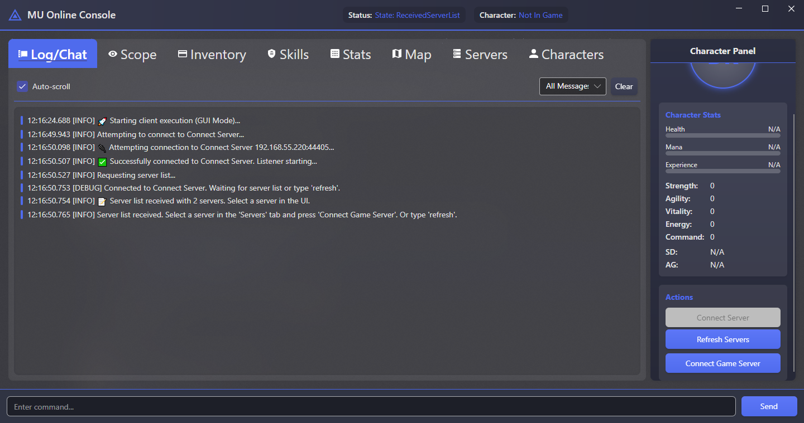
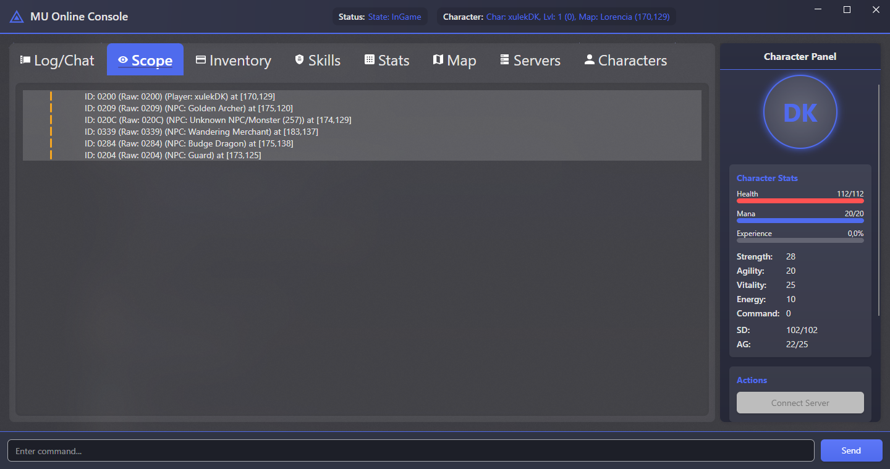
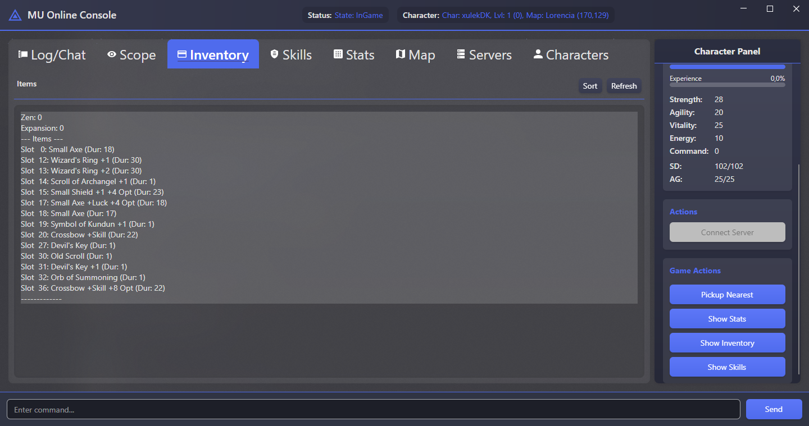
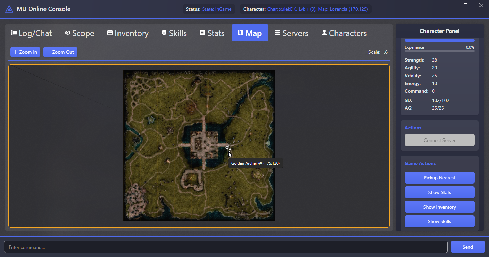
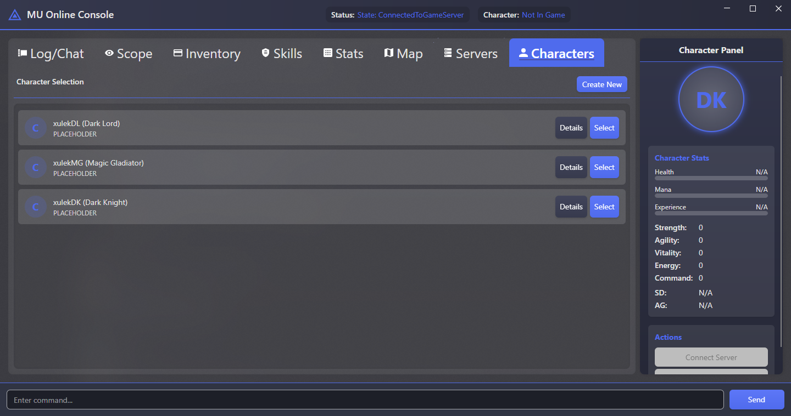

# MU Online Console Client (with Avalonia GUI)

A modern, modular C# client with an Avalonia GUI frontend for connecting, logging in, and interacting with a MU Online server. Built upon the `MUnique.OpenMU.Network` library, featuring full packet parsing and protocol version handling.

## Features

**Core Networking & Protocol:**

*   Connects to ConnectServer and GameServer.
*   Logs in using username and password configured in `appsettings.json`.
*   Receives and displays the character list.
*   Selects a character and enters the game world.
*   Parses real-time packets (HP, Mana, SD, AG, Position, Stats, Skills, Server Messages, Objects in Scope, Inventory, Weather, Events, etc.).
*   Tracks full character state:
    *   HP, Mana, SD, AG
    *   Current and Max stats
    *   Position, Name, ID, Level, Experience
    *   Inventory (items, zen, expansion state)
    *   Skill list (add/remove updates)
*   Supports multiple MU Online protocol versions (configurable):
    *   Season 6 (with support for Extended packets)
    *   0.97d
    *   0.75
*   Automatically switches from ConnectServer to GameServer after server selection.
*   Distinguishes packet handling between ConnectServer and GameServer using a unified routing layer.
*   Loads all settings (host, login, protocol, version, direction map) from `appsettings.json`.

**Avalonia GUI Frontend:**

*   **Modern User Interface:** Provides a user-friendly graphical interface built with Avalonia.
*   **Tabbed Views:** Organizes information into tabs:
    *   **Log/Chat:** Displays client logs and server messages with auto-scroll toggle.
    *   **Scope:** Lists visible players, NPCs, items, and money.
    *   **Inventory:** Shows character's inventory items and Zen.
    *   **Skills:** Displays learned skills.
    *   **Stats:** Presents detailed character statistics.
    *   **Map:** Visual 2D map showing the character and nearby objects (players, NPCs, items, money). Supports zooming.
    *   **Servers:** Lists available game servers from the Connect Server.
    *   **Characters:** Shows the character list for selection.
*   **Character Panel:** A persistent panel on the right displaying key character stats (HP, Mana, Exp bars, core stats) and action buttons.
*   **Action Buttons:** Provides buttons for common actions like:
    *   Connect Server / Refresh Servers / Connect Game Server
    *   Select Character
    *   Pickup Nearest Item
    *   Show Stats / Show Inventory / Show Skills (prints details to Log tab)
*   **Command Input:** Retains a command input box for text-based commands (`move`, `walk`, `walkto`, etc.).

## Screenshots

**Main View (Log/Chat Tab):**

*Shows the main log, character panel with stats, and connection status.*

**Scope Tab:**

*Displays objects currently visible to the character.*

**Inventory Tab:**

*Shows the character's items and Zen amount.*

**Map Tab:**

*Visual representation of the game map with the character and nearby objects.*

**Characters Tab:**

*Allows selection from the available characters on the account.*

## Project Structure

```plaintext
MuOnlineConsole/
├── Configuration/              ← Configuration models and JSON settings
│   ├── MuOnlineSettings.cs
│   └── appsettings.json
│
├── Core/                       ← Domain logic, core models and utilities
│   ├── Models/
│   │   ├── ScopeObject.cs
│   │   └── ServerInfo.cs
│   └── Utilities/
│       ├── CharacterClassDatabase.cs
│       ├── ItemDatabase.cs
│       ├── MapDatabase.cs
│       ├── NpcDatabase.cs
│       ├── PacketHandlerAttribute.cs
│       └── SubCodeHolder.cs
│
├── Networking/                 ← Network-related functionality
│   ├── PacketHandling/
│   │   ├── Handlers/           ← Specific packet handler classes
│   │   │   ├── CharacterDataHandler.cs
│   │   │   ├── ChatMessageHandler.cs
│   │   │   ├── ConnectServerHandler.cs
│   │   │   ├── IGamePacketHandler.cs
│   │   │   ├── InventoryHandler.cs
│   │   │   ├── MiscGamePacketHandler.cs
│   │   │   └── ScopeHandler.cs
│   │   ├── PacketBuilder.cs
│   │   └── PacketRouter.cs
│   └── Services/
│       ├── CharacterService.cs
│       ├── ConnectionManager.cs
│       ├── ConnectServerService.cs
│       └── LoginService.cs
│
├── Client/                     ← Main client logic, state handling, commands
│   ├── CharacterState.cs
│   ├── ClientEnums.cs
│   ├── ScopeManager.cs
│   └── SimpleLoginClient.cs
│
├── GUI/                        ← Avalonia UI Frontend
│   ├── ViewModels/
│   │   ├── MainWindowViewModel.cs
│   │   ├── MapObjectViewModel.cs
│   │   └── ... (ServerInfoViewModel, CharacterInfoViewModel)
│   ├── Views/
│   │   ├── MainWindow.axaml
│   │   └── MainWindow.axaml.cs
│   └── Converters/
│       └── ObjectConverters.cs
│
├── App.axaml                   ← Avalonia Application definition
├── App.axaml.cs                ← Avalonia Application logic
├── Program.cs                  ← Application entry point
├── MuOnlineConsole.csproj      ← Project file
└── README.md
```

## Requirements

*   **.NET 9 SDK** (or newer)
*   A working MU Online server (ConnectServer + GameServer) compatible with one of the supported protocol versions.
*   Access to the `MUnique.OpenMU.Network` library (via NuGet).
*   Access to the `Pipelines.Sockets.Unofficial` library (via NuGet, used by `ConnectionManager`).
*   Avalonia UI framework and related packages (e.g., `Avalonia`, `Avalonia.Desktop`, `Avalonia.Themes.Fluent`, `CommunityToolkit.Mvvm`).

## How to Run

1.  Clone or download the repository.
2.  Open the project in Visual Studio / Rider or use the terminal.
3.  **Configure the client:** Open `appsettings.json` and set:
    *   `ConnectServerHost`, `ConnectServerPort`: Your server's address and port.
    *   `Username`, `Password`: Your login credentials.
    *   `ProtocolVersion`: One of `Season6`, `Version097`, `Version075`.
    *   `ClientVersion`, `ClientSerial`: Version string and serial used during login.
    *   `DirectionMap`: Direction remapping (only if your server uses non-standard mappings).
    *   `PacketLogging`: Configure verbosity (e.g., `ShowWeather`, `ShowDamage`).
4.  Ensure `appsettings.json` is set to **Copy if newer** or **PreserveNewest** in build properties, or add this to your `.csproj`:

    ```xml
     <ItemGroup>
       <None Update="appsettings.json"> <!-- Ensure path is correct -->
         <CopyToOutputDirectory>PreserveNewest</CopyToOutputDirectory>
       </None>
     </ItemGroup>
    ```

5.  Restore dependencies, build, and run the project:

    ```bash
    dotnet restore
    dotnet build
    dotnet run
    ```

## Usage

When launched, the application window will appear.

1.  **Connect:** Use the "Connect Server" button in the right-hand Character Panel.
2.  **Server List:** Once connected to the Connect Server, the "Servers" tab will populate (or use the "Refresh Servers" button). Select a server from the list.
3.  **Game Server:** Click the "Connect Game Server" button (enabled after selecting a server).
4.  **Login:** The client will automatically attempt to log in using credentials from `appsettings.json`.
5.  **Character Selection:** If login is successful, the "Characters" tab will show your character list. Select a character and click the "Select Character" button.
6.  **In-Game:** Once in game:
    *   View character status in the right-hand **Character Panel**.
    *   Monitor logs and messages in the **Log/Chat** tab.
    *   See nearby objects in the **Scope** tab and visually on the **Map** tab.
    *   Check your items in the **Inventory** tab and skills in the **Skills** tab.
    *   View detailed stats in the **Stats** tab.
    *   Use **Action Buttons** like "Pickup Nearest".
    *   Use the **Command Input** box at the bottom for specific commands.

**Available Commands (in Input Box):**

*   `exit` – Gracefully shuts down the client application.
*   `scope` – Lists visible in-game objects in the Log tab (redundant with Scope tab).
*   `move X Y` – Sends instant move request to coordinates.
*   `walk <dir1> [dir2] ...` – Sends directional walk steps (0-7).
*   `walkto X Y` – Sends a walk sequence toward target position (basic pathfinding, no obstacle avoidance).
*   `pickup <near | ItemID>` - Picks up the nearest item/zen or item by ID (use Hex or Dec).
*   `servers` / `list` – Displays available servers in the Log tab (redundant with Servers tab).
*   `connect <id>` – Connects to a selected server ID (redundant with UI selection).
*   `stats` / `inv` / `skills` - Prints detailed info to the Log tab (redundant with dedicated tabs).
*   `clearlog` - Clears the Log/Chat tab.

**Directions (Standard):**
0:W, 1:SW, 2:S, 3:SE, 4:E, 5:NE, 6:N, 7:NW

## Potential Improvements

*   Full A* pathfinding (obstacle-aware `walkto`) with visual path display on map.
*   Extended support for NPC interaction (dialogs, shops), trading, skill usage via UI elements.
*   More interactive map elements (clicking objects for info/interaction).
*   Packet recording and replay functionality.
*   Full character management (create/delete) via UI.
*   Auto-reconnect mechanism.
*   Enhanced UI themes and customization.
*   Improved error handling and user feedback in the UI.

## License

This project is released under the MIT License.

Note: The client uses the `MUnique.OpenMU.Network` library which has its own licensing. Check the original repository for full license terms if reusing the networking components in another project.